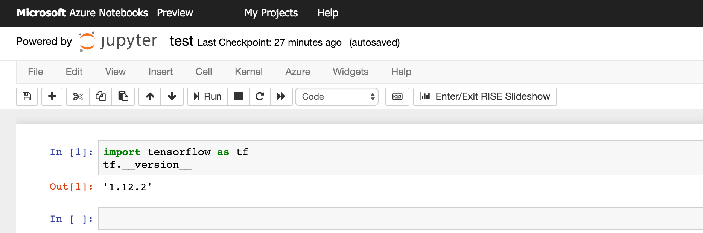

## Part 2 - Import and run the model

To demonstrate how to run the model, we will import it into a Jupyter Notebook and consume it with some Python code.

> In addition to TensorFlow, Custom Vision Service can also export the model in other formats, including CoreML, ONNX, and even a Dockerfile so you can run it as a container. Check out the resources section below for more details.

### Create a Jupyter Notebook with Azure Notebooks

Azure Notebooks is a free service that lets you run and share Jupyter Notebooks in the cloud. You can use its free hosted environment to run your notebooks, or you can connect your notebooks to data science virtual machines to take advantage of larger CPUs, memory, and even GPUs.

1. Browse to [notebooks.azure.com](https://notebooks.azure.com/).

1. Sign in with a Microsoft account. Use the same account that you used in Part 1.

1. Click on *New Project* and enter a project name. Select *public* if you want to share this project with others. Click *Create* to create the project.

    > If you need more information on how to get started with Azure Notebooks, check out the [quickstart documentation](https://docs.microsoft.com/azure/notebooks/quickstart-create-share-jupyter-notebook).

1. Open the new project, click the *+* button and choose *Notebook*. Give the notebook a name and select *Python 3.6*. Then click *New*.

1. Next we'll upload our model. Click the *Upload* button and upload the model (`model.pb` and `labels.txt`) to the same folder as the new notebook.

    > If you did not build your own model, you can use the [pre-built model here](app/model/).

1. Click on the notebook to open it. Wait for the kernel to be ready. If prompted, select *Python 3.6*.

1. Test that everything is working by checking the version of TensorFlow that is in the environment. Enter the following code into the first cell.

    ```python
    import tensorflow as tf
    tf.__version__
    ```

1. Click *Run* or press *Shift-Enter* to run the cell.

    When the cell is executing, `[*]` appears to its left. When execution completes, it should display a number such as `[1]` and the TensorFlow version (should be version 1.x).

    

1. In the next cell, paste in the contents of [**this file**](predict_helpers.py). It contains helper methods for preprocessing the image into an input format compatible with the Custom Vision exported model.

1. Click *Run* or press *Shift-Enter* to run the cell. Since there are only helper function declarations, there is no output.

1. In the next cell, paste in the following function that preprocesses the image and uses TensorFlow to predict if it contains a cat or a dog.

    ```python
    def predict_image(image):
        _initialize()

        try:
            if image.mode != "RGB":
                image.convert("RGB")

            w,h = image.size
            
            # Update orientation based on EXIF tags
            image = _update_orientation(image)

            # If the image has either w or h greater than 1600 we resize it down respecting
            # aspect ratio such that the largest dimention is 1600
            image = _resize_down_to_1600_max_dim(image)

            # Convert image to numpy array
            image = _convert_to_nparray(image)
            
            # Crop the center square and resize that square down to 256x256
            resized_image = _extract_and_resize_to_256_square(image)

            # Crop the center for the specified network_input_Size
            cropped_image = _crop_center(resized_image, network_input_size, network_input_size)

            tf.reset_default_graph()
            tf.import_graph_def(graph_def, name='')

            with tf.Session() as sess:
                prob_tensor = sess.graph.get_tensor_by_name(output_layer)
                predictions, = sess.run(prob_tensor, {input_node: [cropped_image] })
                
                result = []
                highest_prediction = None
                for p, label in zip(predictions, labels):
                    truncated_probablity = np.float64(round(p,8))
                    if truncated_probablity > 1e-8:
                        prediction = {
                            'tagName': label,
                            'probability': truncated_probablity }
                        result.append(prediction)
                        if not highest_prediction or prediction['probability'] > highest_prediction['probability']:
                            highest_prediction = prediction

                response = {
                    'predictedTagName': highest_prediction['tagName'],
                    'prediction': result 
                }

                return response
                
        except Exception as e:
            return 'Error: Could not preprocess image for prediction. ' + str(e)
    ```

    Press *Shift-Enter* to run the cell.

1. Finally, in the next cell, enter the following code that downloads an image and calls `predict_image()`.

    ```python
    image_url = "https://raw.githubusercontent.com/Azure-Samples/functions-python-tensorflow-tutorial/master/resources/assets/samples/cat1.png"

    with urlopen(image_url) as testImage:
        image = Image.open(testImage)
        print(predict_image(image))
        plt.imshow(image)
        plt.show()
    ```

    Press *Shift-Enter* to run the cell. A prediction (`predictedTagName`) and the image should appear.

    

1. Change `image_url` to `https://raw.githubusercontent.com/Azure-Samples/functions-python-tensorflow-tutorial/master/resources/assets/samples/dog1.png` and run it again.

Congratulations, you've built a custom machine learning model that classifies images and used it in a Python script. Imagine taking this model and running it in a Django or Flask web application. You can also check out the following resources for ideas on what to do next.

