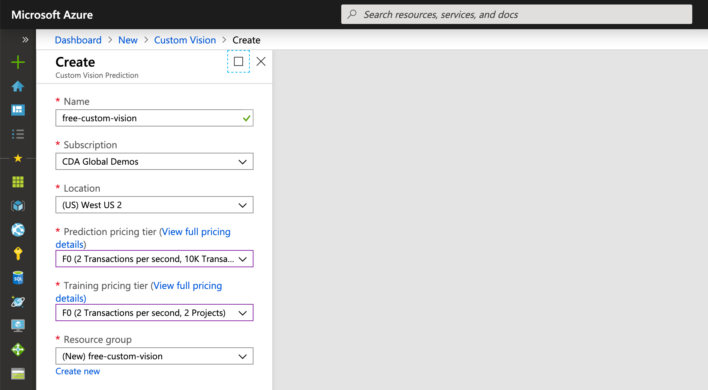
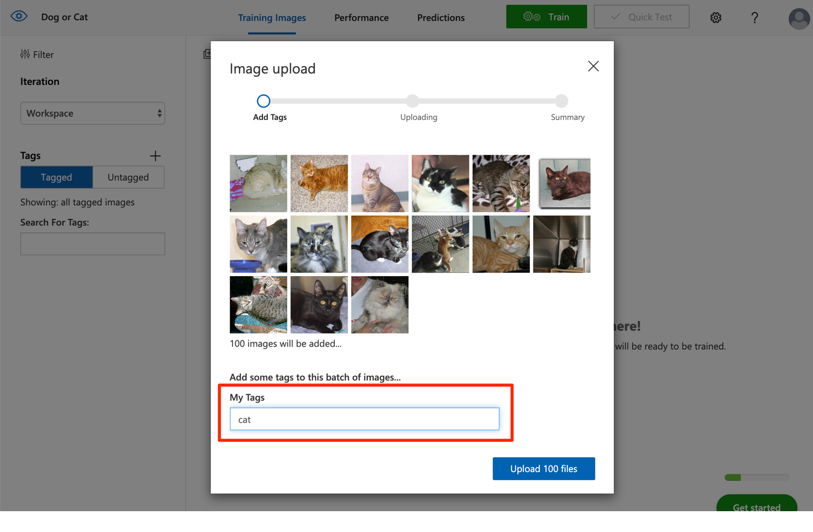
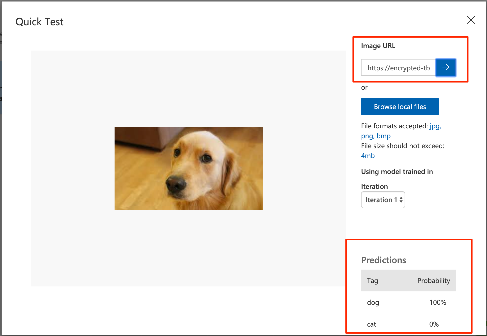

# Train and export a TensorFlow model with Azure Custom Vision Service

To build an image classifier, you need to create an Azure Custom Vision Service project and provide training images. For more information about the steps that you take in this section, see [How to build a classifier with Custom Vision](https://docs.microsoft.com/azure/cognitive-services/custom-vision-service/getting-started-build-a-classifier?WT.mc_id=functionspython-github-antchu).

Once your image classifier is trained, you can export it as a TensorFlow model that you can run in your Python Azure Functions.

## Prerequisites

* **Microsoft Azure subscription** - Although Custom Vision has a free tier, it must be accessed using an Azure subscription. If you need an Azure subscription, sign up for a [free trial](https://azure.microsoft.com/free/?WT.mc_id=functionspython-github-antchu).

## Create a Custom Vision account

1. In your web browser, navigate and log in to the [Azure portal](https://portal.azure.com/?WT.mc_id=functionspython-github-antchu).

1. Select the **Create a resource** button (green **+**).

1. Search for and select *Custom Vision*.

1. In the Create screen, enter the following values.

   | Field | Value |
   | ----- | ----- |
   | Name | Provide a name for your Custom Vision account. |
   | Subscription | Subscription in which to create the account. |
   | Location | Select a region close to you. |
   | Prediction Pricing Tier | Select F0 for the free tier. (may not be available if you already have another Custom Vision account) |
   | Training Pricing Tier | Select F0 for the free tier. (may not be available if you already have another Custom Vision account) |
   | Resource Group | Create or select a resource group. |

1. Select **Create** to create the account.

    

## Download and extract training images

You will use the Kaggle Cats and Dogs dataset to train the image classifier.

1. Download a zip archive of the image dataset at [aka.ms/htn-animals](https://aka.ms/htn-animals).

    > This zip file contains a small subset of image files from this much larger Microsoft dataset at [this web page](https://www.microsoft.com/en-us/download/details.aspx?id=54765&WT.mc_id=functionspython-github-antchu).

1. Extract the zip archive to a folder.

1. In the **PetImages** folder, you will find a folder of cat photos, and another folder of dog photos.

## Create a new Custom Vision project

1. In your web browser, navigate to [Azure Custom Vision Service](https://www.customvision.ai/).

1. Select **Sign in** and sign in with the same account that you used to create the Custom Vision account.

1. Select **New project**.

1. Create your project with the following values:

   | Field | Value |
   | ----- | ----- |
   | Name | Provide a name for your project, like **Dog or Cat**. |
   | Description | Optional project description. |
   | Resource Group | Select the Custom Vision account you created. |
   | Project Types | **Classification** |
   | Classification Types | **Multiclass (single tag per image)** |
   | Domains | **General (compact)** |
   | Export Capabilities | **Basic platforms (Tensorflow, CoreML, ONNX, ...)** |

1. Select **Create project**.

## Train the model

1. In the new Custom Vision project, select **Add images**.

1. Browse to where you extracted the training images and select approximately 100 image files in the **Cat** folder.

1. Tag the images with the value **cat**.

1. Select **Upload images**.

    

1. Select **Add images** and select another 100 photos from the **Dog** folder. Tag them **dog**.

1. Select **Train** and choose **Fast Training** as the training type.

1. Select **Train** and wait for the training to complete.

> To train an even better model, you can upload more images. You can also upload images that contain neither a dog nor a cat and apply the built-in **Negative** tag.

## Test the model

1. Select **Quick Test**.

1. Provide a URL of an image containing a cat or a dog.

1. Submit it to see the result.

    

## Export the model

1. Select the **Performance** tab.

1. Select **Export**.

1. Select **TensorFlow**.

    

1. Select **Export**. Wait for the export process to complete.

1. Select **Download** to download the model.

The download is a zip archive containing two files: *model.pb* and *labels.txt*. Extract these files into a folder on your computer. You'll need those later.
